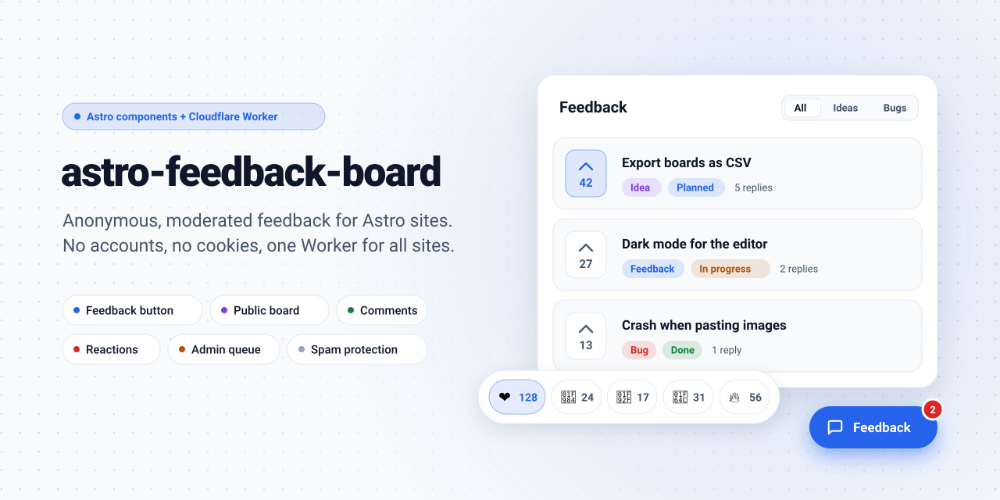

<picture>
  <source media="(prefers-color-scheme: dark)" srcset=".github/assets/hero-dark.svg">
  
</picture>

# astro-feedback-board

[](https://github.com/SlashGordon/astro-feedback-board/actions/workflows/ci.yml) [](https://github.com/SlashGordon/astro-feedback-board/actions/workflows/release.yml)

Anonymous, moderated feedback for Astro sites. Visitors post feedback without an account, an admin approves it in a small panel, and one Cloudflare Worker serves all sites.

`<FeedbackButton />`, `<FeedbackAsk />` and `<FeedbackBoard />` cover feedback with votes, replies, the reply badge, per-site moderation and trusted devices. `<FeedbackComments />` adds dev.to-style reactions and moderated comments to articles, and `<FeedbackPrompt />` asks for feedback after some minutes of active use. Merging duplicates and reports are not built yet.

The package started as the feedback system of [Fuseplan](https://www.fuseplan.app/) and was extracted from the app so other Astro sites can use it.

## Repository

- `packages/astro/`: the npm package with the Astro components and the client script
- `worker/`: the Cloudflare Worker with the public API, admin panel and D1 migrations
- `demo/`: a small Astro site for local testing

The Worker imports `astro-feedback-board/protocol` from the package, so kinds, topic statuses, content rules and response types are defined once. [CONTEXT.md](CONTEXT.md) lists the domain terms and modules.

## Local development

```sh
npm install
npm run dev
```

`npm run dev` creates `worker/.dev.vars` if it is missing, applies the D1 migrations, seeds the `demo` site and starts both servers:

- Worker: http://localhost:8787, admin panel at http://localhost:8787/admin
- Demo site: http://localhost:4321, board at http://localhost:4321/feedback

Open the demo under `localhost:4321`. The Worker only accepts posts from origins registered for the site, and the seed registers `http://localhost:4321` and `http://127.0.0.1:4321`. If a post fails, the browser console shows the reason, for example `[feedback-board] 403 origin_not_allowed`.

`.dev.vars` sets `DEV_SKIP_ACCESS=true`, which opens `/admin` without Cloudflare Access. Never set it in production.

`npm test` runs the component and Worker tests. The Worker tests start a local D1 database through wrangler's platform proxy and apply the migrations, so they check the real SQL, including foreign keys.

## Deploying the Worker

1. `npx wrangler d1 create feedback --jurisdiction eu` and put the database id into `worker/wrangler.jsonc`. The jurisdiction keeps the stored data in the EU.
2. Change the route in `wrangler.jsonc` to your own domain.
3. `npm --workspace worker run db:migrate:remote`
4. Set the secret: `npx wrangler secret put ALTCHA_HMAC_KEY` (a long random string).
5. Optional: set `NTFY_URL` in `wrangler.jsonc` to an ntfy topic (`https://ntfy.sh/<long-random-topic>`) to get a push for every new post, and `npx wrangler secret put NTFY_TOKEN` if the topic needs a token. The push contains the site, the kind and a link to the admin panel. The post text is only included with `NTFY_INCLUDE_TEXT` set to `"true"`, because it then goes to the ntfy server.
6. Create a Cloudflare Access application for `<your-domain>/admin*` and set `ACCESS_TEAM_DOMAIN` (`https://<team>.cloudflareaccess.com`) and `ACCESS_AUD` in `wrangler.jsonc`. The Worker checks the Access JWT itself and answers 403 without it.
7. `npm --workspace worker run deploy`

## Using the components

```astro
---
import { FeedbackAsk, FeedbackBoard, FeedbackButton } from "astro-feedback-board/components";
---

<FeedbackButton site="fuseplan" endpoint="https://feedback.dieck-labs.de" lang="de" boardUrl="/feedback" />

<FeedbackAsk
  site="fuseplan"
  endpoint="https://feedback.dieck-labs.de"
  lang="de"
  kind="idea"
  question="Welche Funktion fehlt dir?"
/>
```

Reactions and comments go under an article. The prompt goes into the layout once:

```astro
<FeedbackComments site="fuseplan" endpoint="https://feedback.dieck-labs.de" lang="de" />
<FeedbackPrompt site="fuseplan" endpoint="https://feedback.dieck-labs.de" lang="de" after={5} />
```

The board goes on its own page, for example `src/pages/feedback.astro`:

```astro
<FeedbackBoard site="fuseplan" endpoint="https://feedback.dieck-labs.de" lang="de" />
```

It lists approved posts with votes, filters by kind and status, and opens a thread view with replies. Visitors who ticked "Auf diesem Gerät merken" also see their own posts there, including pending ones, and can delete them. The box is unticked by default.

Shared props: `site`, `endpoint`, `lang` (`de`, `en`, `es`), `context` (JSON sent with each post), `privacyUrl` (link to your privacy policy, shown in every form) and `strings` (overrides for the built-in texts).

- `FeedbackButton`: `variant` (`floating` or `inline`), `position` (`bottom-right` or `bottom-left`), `label`, `kind` and `boardUrl` (adds a link to the visitor's own posts on the board).
- `FeedbackAsk`: `question` and `kind`.
- `FeedbackBoard`: `kind` (preselected filter), `sort` (`top` or `new`) and `newPost` (`false` hides the form for new posts).
- `FeedbackComments`: `article` (key for comments and reactions, defaults to the page path), `title`, `reactions` (which reactions to offer, for example `["like", "fire"]`; default all of `like`, `unicorn`, `mindblown`, `clap`, `fire`; `false` hides them) and `comments` (`false` hides the comments).
- `FeedbackPrompt`: `after` (minutes of active use, default 5), `question`, `snoozeDays` (default 30), `position` (`bottom-left` or `bottom-right`) and `kind`.

Posts have one of three kinds: `feedback`, `idea` or `bug`. Without `kind`, the form shows a picker. The admin can change the kind in the queue.

To send data that only exists at runtime, such as app state, define a hook before the visitor submits:

```js
window.feedbackBoard = { getContext: () => ({ plan: currentPlan.id }) };
```

The context is stored with the post for as long as the post exists and is shown in the admin panel. Don't put user IDs, email addresses or other personal data into it.

Every form has the spam layers built in: a honeypot field that people never see, a minimum of 3 seconds between rendering and sending, and an ALTCHA proof of work that the browser solves in the background. Reactions use the same layers. The reaction buttons collect clicks and send the visitor's reactions in one request 2 seconds after the last click, or earlier when the tab is hidden or closed. Trying out the buttons costs one proof of work and counts once against the rate limit.

The Worker also sets limits that a script cannot get around by dropping or rotating its device token. The key is a hash of the IP address with a random salt per day. The Worker stores the salt in D1 and deletes it after two days. From then on nobody, not even the operator, can trace the stored hashes on posts, votes and reactions back to an IP. The cron also deletes the hashes on posts, votes and reactions after two days.

- At most 10 posts per IP and day, and at most 3 posts per device or IP waiting in the queue. Deleting a post does not free its place in the daily count. Trusted devices are exempt.
- One new vote per post and one of each reaction per article, per IP and day. A remembered device votes with its device token, so its vote stays its own on later days. Without a remembered device the vote key is the daily IP hash.

If spam gets through anyway, pause the site in the admin panel. A paused site refuses all posts, votes and reactions until you unpause it.

Styling uses CSS custom properties: `--afb-accent`, `--afb-accent-fg`, `--afb-bg`, `--afb-bg-subtle`, `--afb-fg`, `--afb-muted`, `--afb-border`, `--afb-border-strong`, `--afb-radius`, `--afb-font`, `--afb-error`, `--afb-success`, `--afb-offset` and `--afb-z`. The components use the page's font unless `--afb-font` is set and load no web fonts.

The components switch to dark colors when the page declares `color-scheme: dark`, or `color-scheme: light dark` and the visitor's system is set to dark. Pages without a `color-scheme` stay light.

## Privacy

The components set no cookies, load no third-party scripts or fonts and write to localStorage only after the visitor acts: the device token and nickname after a post with "Auf diesem Gerät merken" ticked, and a snooze time after the visitor dismisses the prompt. A remembered device shows a "Vergessen" button in every form. It deletes the device's posts (with the replies under them), votes, reactions, callsign and trust on the Worker, then all `afb:` keys in localStorage.

What the Worker keeps:

| Data | How long |
| --- | --- |
| Post text, nickname, page URL without query, context | Approved posts until deleted, rejected and spam posts 30 days |
| Device hash (sha256 of the token) on posts, votes, reactions and read markers | Until the posts are deleted or the device is forgotten |
| Daily IP hash on posts, votes and reactions, and in the daily post count | 2 days |
| Daily IP salt | 2 days, after that votes and IP-keyed reactions are anonymous |
| Signatures of used ALTCHA challenges | Until the daily cleanup after they expire (30 minutes) |

Visitors without a remembered device cannot delete their posts themselves, so name a contact for deletion requests in your privacy policy. [docs/datenschutz.md](docs/datenschutz.md) is a German template for that section of the privacy policy. The Worker runs on Cloudflare, which processes the IP address of every request, including the requests that `<FeedbackBoard />` and `<FeedbackComments />` send when the page loads.

## License

[MIT](./LICENSE) © [SlashGordon](https://www.slashgordon.link).

## Support

If this package saves you time, consider buying me a coffee. It keeps the maintenance going.

<a href="https://buymeacoffee.com/SlashGordon"></a>
